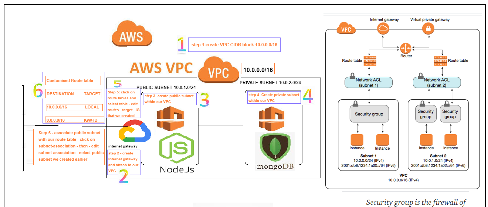

# AWS

__Description:__

First iteration:

- Launch an ec2 instance with correct version of ubuntu.
- ssh into the instance.
- Update.
- Upgrade.
- Install nginx.
- Access nignx page with public IP.
- Share the IP to check if it is working.

Second Iteration:

- Copy code from OS to AWS EC2 app with scp command.
- Install required dependencies for nodejs.
- Launch the nodeapp. 

Third Iteration:

- Create an EC2 instance for db.
- Install mongodb with requited dependencies.
- Allow access only from the app instance.
- Connect the app with db to fetch the data.
- App to work with reverse proxy without 3000 port, fibu, /posts.
- Do reverse proxy with ngnix.

Fourth interaction:

- Create and configure VPC.
- Create public subnet for the app and private subnet for the db.
- Create the Internet Gateway and configure.
- Managing the route tables.
- Add the instances in the correspondent subnet.
- Connecting to the instances.
- Create and configure NACL.
- Check that everything is working properly in the browser.

### 2 TIER APP DEPLOYMENT ON AWS



A two-tier architecture is a software architecture in which a presentation layer or interface runs on a client, and a data layer or data structure gets stored on a server. Separating these two components into different locations represents a two-tier architecture, as opposed to a single-tier architecture. Two tier architecture provides added security to the DBMS(A database management system) as it is not exposed to the end-user directly. It also provides direct and faster communication.

Wherewith our scenario is the following:

- 2 different machines on the same cloud.
- Ubuntu 16.04 app EC2 with Nodejs and Nginx - Public IP
- Ubuntu 16.04 for Mongo DB - No public IP, only accessible from the app machine.
- Can restart the app without restarting the database.

When the presentation layer (interface) runs on a client and a data layer/structure (database) gets stored on a server. Basically, when each instance is run on a separate machine. It separates these two components into different locations. Having separate layers can improve performance and scalability. Easy to maintain.

## Create instances for App and Database

Let's create our two instance but without defining our VPC. We want to make two instances working properly, giving the correct service. We will connect our App with the Database to create our 2-Tier architecture correctly.

### EC2 INSTANCE FOR OUR NODEAPP

We will create the instance for the app:

Click on the [link](https://github.com/alfonso-torres/eng84_multi_machine_vagrant) to get the code for the app (download it) and the provision file that we will use during the installation of the instance.

- Click `Launch Instance`.
- Choose `Ubuntu Server 16.04 LTS (HVM), SSD Volume Type`.
- Choose `t2.micro` as the instance type by default.
- In the configuration instance details:

1. Change the VPC to your VPC.
2. Change the subnet to your public subnet.
3. Make sure you enable `Auto-assign public IP` for the app. We need to go inside the instance.

- Leave `Add Storage` by default.
- Add a tag with the `Key` as `Name` and the value as `eng84_jose_app_instance`. Make sure they are relevant names.
- Security group: we need to create one new. Name should be `eng84_jose_app_sg` and description: `security group for app instance`. 

For the SSH rule, follow these rules: Port `22`, Source `My IP`, Description `access only from my IP`.

Add another rule to have access to the internet and set up the service for the client. The rule should be `HTTP`, the port `80`, the custome service `0.0.0.0/0, ::/0` (Default) and the description `allowed for anywhere, http access`.

- Review and Launch.
- Select the existing DevopsStudent key:pair option for SSH, or the Key that you want to use.
- Wait until the machine is running and passed all the tests.
- Open a terminal and run `cd ~/.ssh`. Check that you have your key permision that allows you to connect to the instance. The same that we have selected before.
- Go to the dashboard of the instance app. Click on the button `Connect` and select ssh.
- Copy ssh example and go to terminal again and run the command inside the `~/.shh` directory.
- Select yes in all the steps and you will be inside the instance.
- Run the following commands:

1. `sudo apt-get update -y`
2. `sudo apt-get upgrade -y`
3. `sudo apt-get install nginx`
4. Check if the service nginx is running: `sudo systemctl status nginx`

- Go back to your instance in AWS. Copy the public IP and write down in the browser. If you are able to see the service of nginx with the IP, everything is working correctly.
- Next step is run the app in the instance.
- Go to the folder where is allocated all the app.
- Execute the following command to copy the app from your local machine to your instance: `scp -i ~/.ssh/DevOpsStudent.pem -r path_project_app ubuntu@app_ec2_public_ip:~/app/`. It will take a while.
- Go back to the terminal where you are logged in the instance. Run `ls -l` to see if everything was copied correctly.
- Search you `provision.sh` for the app and run it. It should install all the dependencies to run the app. Change the permissions with `chmod +x provision.sh` if it is needed to execute the file. To execute `sudo ./provision.sh`.

__Note:__ My provision.sh doesn't work? What can I do?:

1. First open it using sudo nano provision.sh
2. If it says Converted from DOS format then this guide will help you. If it doesn't then seek help.
3. Do the following commands in order:

- `wget "http://ftp.de.debian.org/debian/pool/main/d/dos2unix/dos2unix_6.0.4-1_amd64.deb"`.
- `sudo dpkg -i dos2unix_6.0.4-1_amd64.deb`.
- `dos2unix provision.sh`.

- Go to the folder where you have allocated your app and run `npm install`.
- Then run the app: `node app.js` and you will see the port where is listenning.
- Go the browser and check that if the app is working properly.
- If for same reasons you need to allow the port 3000, go to your instance, select `Security` tab. Edit your Security Group. Click in `Edit inbound rules`. Select `TCP`. Custom `3000`. Source `Anywhere` and saved.
- Go back to your browser and enter: `public_IP_instance_app:3000`. It should be working correctly.
- If you can see the app with only the public IP is because your provision file have installed reverse proxying with nginx. If not, we should change the configuration and restart the service nginx to only use the public IP without the port to see the app. Go to `cd /etc/nginx/sites-available/`. Remove the default file `sudo rm -rf default`. Create new one `sudo nano default` and add these lines:

````
server {
    listen 80;
    server_name _;
    location / {
        proxy_pass http://localhost:3000;
        proxy_http_version 1.1;
        proxy_set_header Upgrade \$http_upgrade;
        proxy_set_header Connection 'upgrade';
        proxy_set_header Host \$host;
        proxy_cache_bypass \$http_upgrade;
    }
}
````

Saved the file.
- Restart nginx: `sudo systemctl restart nginx`
- Go to your browser. Enter only the public IP for the instance app and you will see app without the port.
- You have configured your instance app correctly.

### EC2 INSTANCE FOR DATABASE

We will create the instance for the database:

- Click `Launch Instance`.
- Choose `Ubuntu Server 16.04 LTS (HVM), SSD Volume Type`.
- Choose `t2.micro` as the instance type by default.
- In the configuration instance details:

1. Change the VPC to your VPC.
2. Change the subnet to your subnet.
3. Make sure you enable `Auto-assign public IP` for the db. We put it public but we want only us to have access to it. This is the magic of 2-Tier architecture. But we will add the corresponding rules so that only we have access. But we need to make it public to have access to it and be able to install mongodb inside the instance.

- Leave `Add Storage` by default.
- Add a tag with the `Key` as `Name` and the value as `eng84_jose_db_instance`. Make sure they are relevant names.
- Security group: we need to create one new. Name should be `eng84_jose_db_sg` and description: `security group for db instance`. 

For the SSH rule, follow these rules: Port `22`, Source `My IP`, Description `access only from my IP`.

Add another rule to be able to access the internet in the db instance, but through our private IP, because we don't want to give access to anyone else, only ourselves. The rule should be `Custom TCP`, the port `27017`, the custome service `private IP from the instance app` (Not public for the reason that it changes everytime that we restart the instance)and the description `Allowed internet from the port 27017 only from app instance`. In this way we will have access to the db instance only for us, and we will receive internet only through the instance app. We do not want access anywhere else. This allows the app to connect to db locally.

- Review and Launch.
- Select the existing DevopsStudent key:pair option for SSH, or the Key that you want to use.
- Wait until the machine is running and passed all the tests.
- Open a terminal and run `cd ~/.ssh`. Check that you have your key permision that allows you to connect to the instance. The same that we have selected before.
- Go to the dashboard of the instance app. Click on the button `Connect` and select ssh.
- Copy ssh example and go to terminal again and run the command inside the `~/.shh` directory.
- Select yes in all the steps and you will be inside the instance.
- Run the following commands:

1. `sudo apt-get update -y`
2. `sudo apt-get upgrade -y`
3. `wget -qO - https://www.mongodb.org/static/pgp/server-3.2.asc | sudo apt-key add -`
4. `echo "deb http://repo.mongodb.org/apt/ubuntu xenial/mongodb-org/3.2 multiverse" | sudo tee /etc/apt/sources.list.d/mongodb-org-3.2.list`
5. `sudo apt-get update`
6. `sudo apt-get install -y mongodb-org=3.2.20 mongodb-org-server=3.2.20 mongodb-org-shell=3.2.20 mongodb-org-mongos=3.2.20 mongodb-org-tools=3.2.20`
7. `sudo mkdir -p /data/db`
8. `sudo chown -R mongodb:mongodb /var/lib/mongodb`
9. `sudo sed -i 's/127.0.0.1/0.0.0.0/g' /etc/mongod.conf`
10. `sudo systemctl enable mongod`
11. `sudo systemctl start mongod`
12. Check if the service mongod is running: `sudo systemctl status mongod`

- Now we have our two instances running correctly. It is time to connect App with DB.

### Connection from App to Database

We are going to create the environment variable to make the connection.

- Go inside to the instance of the app in the terminal (ssh)
- We will save our variable in the file `.bashrc` because we want to have a persistent variable. It will be there every moment we restart the machine.
- Run this command: `sudo echo "export DB_HOST=mongodb://private_IP_db:27017/posts" >> /home/ubuntu/.bashrc`
- After that run: `source ~/.bashrc`. It will check if there is any error in the file and to reload again.
- Run `env` to check if the variable was created correctly.
- Go back to the app folder and run the followings commands:

1. `npm install`
2. `node seeds/seed.js` to get the information from the database. We can check if the connection was established correctly.
3. Run the app `node app.js`. Go to the browser and enter: `public_IP_app/posts`

- We finished. If we can see the posts, we got the connection from the app to the database. Good job!

### Create images for the two instances

- Go to the dashboard of the instances.
- Select the instance that you want to take a snapshot.
- Click in the button `Actions`.
- Then `Image and templates`.
- After that click on `Create Image`.
- In the name `eng84_jose_tier2_app_ami` and description `eng84_jose_tier2_app_ami`.
- Finally click `Save`. It will take a while to save it.
- Repeat the same steps for the other instance.

It will help us for the reason of when we create our vpc, we will be able to use the images of these instances instead of creating everything from scratch to be able to add them to our subnets.

### GUIDE - VPC - SUBNETS - INTERNET GATEWAY - ROUTE TABLES - NACL

Before we crack on the task, let's see some definitions to understand what is the purpose of the task and what are the benefits.

__What is a VPC:__

- VPC Virtual Private Cloud to define and control virtual network.
- VPC enables you to launch AWS resources into a virtual network that you have. This is virtual network closely resembles a traditional network that you'd operate in your data centre.
- It allows us to EC2 instances to communicate with each other. We can also multiple subnets within out VPC.
- It benefits us with scalibility of infrastructure of AWS.

__Internet Gateway:__

- Internet is the point which allowed us to connect to Internet.
- A gateway that you attach to your VPC to enable communication between resources in your VPC and the internet.

__What is a subnet:__

- Network inside the VPC, they make network more sufficient.
- A range of IP addressess in your VPC.
- A subnet could have multiple EC2 instances.
- With have private and public, to limit the access.

__Route Table:__

- Set of rules, called routes.
- Route tables are used to determine where external network traffic is directed.

__NACLS:__

- NACLS are an added layer of defence they work at the network level.
- NACLs are stateless, you have to have rules to allow the requests to come in and to allow the response to go back out.

We will create the following NACLs for the subnets:

For the __public subnet__:

- Inbound rules:

1. 100 -> Allows inbound HTTP 80 traffic from any IPv4 address.
2. 110 -> Allows inbound SSH 22 traffic from your network over the internet. Make sure that custom the source with your IP.
3. 120 -> Allows inbound return traffic from hosts on the internet that are responding to requests originating in the subnet. TCP 1024-65535.

- Outbound rules:

1. 100 -> To allow port 80.
2. 110 -> We need the CIDR block and allow 27017 for outbound access to our mongo db server in private subnet.
3. 120 -> To allow short lived port between 1024-65535.

For the __private subnet__:

- Inbound rules:

1. 100 -> Allows All traffic from public subnet. In the source make sure you add the IP of your public subnet.
2. 110 -> Allows inbound SSH 22 traffic from your network over the internet. Make sure that custom the source with your IP.
3. 120 -> Allows inbound HTTP 80 traffic from any IPv4 address.

- Outbound rules:

1. 100 -> To allow all traffic outside, for the reason that we have the control what we want from outside in the subnet.

__What is Security Group:__

- Security groups work as a firewall on the instance level.
- They are attached to the VPC and subnet.
- They have inbound and outbound traffic rules defined.
- Security groups are stateful, if you allowed inbound rule that will automatically be allowed outbound.

We will create the following security groups:

For the __app__:

- Inbound rules:

1. Allow port 80 to all (Internet communication).
2. Allow port 22 for ssh.

- Outbound rules:

1. Allow All traffic for the reason that we defined what we want to get from outside world before.

For the __db__:

- Inbound rules:

1. Allow All traffic. But in source select the security group of the app. We only want to get traffic from the app.
2. Allow port 22 for ssh.

- Outbound rules:

1. Allow All traffic for the reason that we defined what we want to get from outside world before.

__What are the Ephemeral ports:__

- They are shortly lived ports, they are automatically allocated based on the demand.
- Allow outbound responses to client on the internet.
- The range from 1024-65535.

__Task:__

Now, we are going to carry out the creation of our VPC, with its respective subnets. We are going to go step by step configuring everything correctly. We will use the two instances that we have created earlier. Finally we will create our NACL to add a layer more security to our network.

- Make sure to choose the location of our instances `Ireland`. It will be our `availability zone`. You can select this at the top right in the main AWS dashboard.

- Make sure that everything you create has a relevant label and name so we know what we are creating.

<u>__STEP 1: Create the VPC__</u>

- Click `Your VPCs`. Then `Create VPC`.
- Change the VPC nametag: `eng84_jose_vpc`.
- Configure IPv4 CIDR block to `0.0.0.0/16` where the first 2 numbers are unique. Your ipv4 CIDR must use 2 unique numbers followed by 2 zero's and then a /16. For example, `24.24.0.0/16`.
- Finally, `Create VPC`.

<u>__STEP 2: Create the Internet Gateway__</u>

- Click `Internet Gateways`. Then `Create internet gateway`.
- Change the nametag: `eng84_jose_ig`.
- Click `Create Internet Gatway`.
- Select the Internet Gateway you have created right now. Click `Actions`. Then `Attach to VPC`. Select the VPC you have created and attach the internet gateway.

<u>__STEP 3: Create the subnets: Public and Private__</u>

- First navigate to the subnet page and click the `create subnet` button.
- Select your VPC.
- Add the Subnet name as `eng84_jose_public_subnet`
- Availability zone to `1c`.
- IPv4 CIDR block to `24.24.1.0/24` as per the VPC IP. This is the IPV4 CIDR for this current subnet, the first two numbers of this must be the same as in VPC IPV4. The third number must be unique, it can't be the same as another subnet you have created. The fourth
number must be 0. Finally we must follow that with /24.
- Then click `Create Subnet`.
- Repeat the above steps for the Private Subnet, but with the applicable name and the third number of the IPv4 CIDR block must be unique `24.24.2.0/24`.

<u>__STEP 4: Managing the route tables__</u>

- The first thing we have to do is go to the route table page and identify the one that is attached to our vpc. Click on the unnamed routes tables until you find the one.
- Rename it to `eng84_jose_public_rt`.
- Next you're going to want to give this subnet internet access by going to `Routes` tab.
- Click `Edit routes` and add a new `Add route`, following this information:

Set the destination to `0.0.0.0/0`.
Set the target to `Internet Gateway`, then select your internet gateway that we have created before.
Save the configurations.

It allows have internet. That's the main point.

- Now we will go back to the page we were on before and associate our public subnet with this route table, start by
clicking on `Subnet Associations` tab and click on `Edit subnet associations`. Select the public subnet you have created and click `save`.
- Now we want to create a new route table for the private subnet (db) with no access to the internet. We will start by clicking
`Create route table`.
- Set the Name tag: `eng84_jose_private_rt`.
- Select your VPC and then click `Create`. NOTE: This route table is not connected to the internet like we did before with the route table for the public subnet.
- We will now associate our private subnet in the same way as we did before.
- With the new route table selected, select the `Subnet Associations` tab.
- Click `Edit subnet associations` and select the private subnet you have created and finally save.
- Your route tables are now setup.

<u>__STEP 5: Creating Security Groups for App and DB__</u>

We proceed to create the security groups at the instance level, both for the app and for the database.

Go to VPC section and search for `Security Groups` in the Security tab.

- Click on `Create Security Group`.
- Security group name: `eng84_jose_app_sg`
- Description: `eng84_jose_app_sg`.
- VPC: select the VPC that we have created.

- Inbound rules:

1. Allow port 80 to all (Internet communication), source `0.0.0.0/0`.
2. Allow port 22 for ssh, with source My IP (only us want to access).

- Outbound rules:

1. Allow All traffic for the reason that we defined what we want to get from outside world before, destination `0.0.0.0/0`.

Let's create another security group for the db instance.

- Click on `Create Security Group`.
- Security group name: `eng84_jose_db_sg`
- Description: `eng84_jose_db_sg`.
- VPC: select the VPC that we have created.

- Inbound rules:

1. Allow All traffic. But in source select the security group of the app. We only want to get traffic from the app.
2. Allow port 22 for ssh, with source My IP (only us want to access).

- Outbound rules:

1. Allow All traffic for the reason that we defined what we want to get from outside world before, destination `0.0.0.0/0`.

We have configured our security groups.

<u>__STEP 6: Adding a NACL to the VPC__</u>

Next we are going to add one more layer of security at the subnet level with NACL (Network Access Control List).

We are going to create two NACLs, one for the public subnet and one for the private subnet.

- Go to VPC section and finding the `Network ACLs`.
- Find the unnamed NACL that is associated with your VPC ID.
- Rename it to `eng84_jose_nacl_public_subnet`.

Now we have to set the inbound rules for the NACL.

- Select our NACL. Go to `Inbound rules` tab.
- Click on `Edit inbound rules`.
- Add the following rules:

1. Rule number `100`. Type `HTTP(80)`. Source `0.0.0.0/0`. This allows external HTTP traffic to enter the network. Allows inbound HTTP 80 traffic from any IPv4 address.
2. Rule number `110`. Type `SSH(22)`. Source My IP. This allows SSH connections to the VPC. Allows inbound SSH 22 traffic from your network over the internet.
3. Rule number `120`. Type `Custom TCP`. Port range `1024-65535`. Source `0.0.0.0/0`. Allows inbound return traffic from hosts on the internet that are responding to requests originating in the subnet. TCP 1024-65535.

- Click `Save changes`.

Now we have to set the outbound rules.

- Select the `Outbound rules` tab.
- Click `Edit outbound rules`.
- Add the following rules:

- Outbound rules:

1. Rule number `100`. Type `HTTP(80)`. Source `0.0.0.0/0`. To request anything outside.
2. Rule number `110`. Type `Custom TCP`. Port range `27017`. Source `private ip subnet`(CIDR). We need the CIDR block and allow 27017 for outbound access to our mongo db server in private subnet.
3. Rule number `120`. Type `Custom TCP`. Port range `1024-65535`. Source `0.0.0.0/0`. Allows inbound return traffic from hosts on the internet that are responding to requests originating in the subnet. TCP 1024-65535.

And the last step, let's assign the subnets to the NACL.

- Select the `Subnet associations` tab.
- Click `Edit subnet associations`.
- Select only the __public__ subnet and save.

Let's create another NACL for the private subnet.

- Go back to the Network ACLs section.
- Click on `Create network ACL`.
- Name: `eng84_jose_nacl_private_subnet`.
- VPC: make sure you select the one that we have created before (eng84_jose_vpc).

- Select our NACL that we have created. Go to `Inbound rules` tab.
- Click on `Edit inbound rules`.
- Add the following rules:

1. Rule number `100`. Type `All traffic`. Source `public ip subnet`(CIDR). This allows external HTTP traffic to enter the network. Allows all traffic only from the public subnet, from the app.
2. Rule number `110`. Type `SSH(22)`. Source My IP. This allows SSH connections to the VPC. Allows inbound SSH 22 traffic from your network over the internet.
3. Rule number `120`. Type `HTTP(80)`. Source `0.0.0.0/0`. This allows external HTTP traffic to enter the network. Allows inbound HTTP 80 traffic from any IPv4 address.

- Click `Save changes`.

Now we have to set the outbound rules.

- Select the `Outbound rules` tab.
- Click `Edit outbound rules`.
- Add the following rules:

- Outbound rules:

1. Rule number `100`. Type `All traffic`. Source `0.0.0.0/0`. To request anything outside.

And the last step, let's assign the subnets to the NACL.

- Select the `Subnet associations` tab.
- Click `Edit subnet associations`.
- Select only the __private__ subnet and save.

Everything has been configured, what we need now is to create our instances and carry out the connection.

<u>__STEP 7: Creating the EC2 instances: App and DB__</u>

In this step we proceed to create our two instances as we did previously.

The only difference is that in this step we are going to modify some options regarding the configuration details of the instance. We want to add the instance of the app on the public subnet and the database on the private subnet.

We will use the images that we have created of the two instances so that we do not have to install everything from scratch.

- App instance:

- Go to EC2 section and click on `AMIs`.
- Select the image of the app that we created at the beginning of the repository.
- Click on `Actions` and then `Launch`.

We will follow the same steps as before, but with some changes.

- In the section `Configure Instance Details`:

1. Network: Select the VPC we created before, in the step 1.
2. Subnet: Select the __public__ subnet we created before, in the step 3.
3. Auto-assign Public IP: Enable.

- In the section `Configure Security Group`:

1. Select an existing security group.
2. Select the security group for the app instance.

The rest is the same as before.

[App Instance](#ec2-instance-for-our-nodeapp)

- DB instance:

- Click again on `AMIs`.
- Select the image of the db that we created at the beginning of the repository.
- Click on `Actions` and then `Launch`.

We will follow the same steps as before, but with some changes.

- In the section `Configure Instance Details`:

1. Network: Select the VPC we created before, in the step 1.
2. Subnet: Select the __private__ subnet we created before, in the step 3.
3. Auto-assign Public IP: Enable.

- In the section `Configure Security Group`:

1. Select an existing security group.
2. Select the security group for the db instance.

The rest is the same as before.

[DB Instance](#ec2-instance-for-database)

<u>__STEP 8: Connecting to the instances__</u>

As we have done before, when we create both instance.

App instance:

- Select your app instance and click `Connect`.
- Copy the command of the example in `SSH client` tab.
- Open the terminal and navigate to `~/.shh/`. 
- Then paste the command and run it.
- Type yes if you are asked some options.
- You are inside the app instance.

DB instance:

- As our db is not connected to the internet, so a proxy ssh is needed.
- We need to get the public IP address of our app instance.
- Then, we need to get the private IP address of our db instance.
- Execute this command to SSH into the db instance: `ssh -i ~/.ssh/DevOpsStudent.pem -o ProxyCommand="ssh -i ~/.ssh/DevOpsStudent.pem -W %h:%p ubuntu@app_public_ip" ubuntu@db_private_ip`.
- You will be connected. But we are not connected to the internet.

<u>__STEP 9: Updating the database__</u>

For the reason that we have given internet access to the database instance with the inbound and outbound rules, the database instance is now accessible to the internet.

- SSH into the database instance just like your app instance.
- Check if everything is working properly (check mongod is running correctly for the reason that is already installed, we are using an AMI of the db instance `sudo systemctl status mongod`).

<u>__STEP 10: Connect App to the Database__</u>

Repeat the same steps like we did before:

[Connection](#connection-from-app-to-database)

Congrutalion's. If everything is working, you are done. Go to your browser and check it.

### Bastion Server Lab - Jump Box

Now that we've created a private subnet for our database instances we have a problem. We no longer have access to them via SSH.

To solve this we need to create a bastion server, also known as a jump box so that we can log in to the bastion and then from there access our database server to perform updates.

- __What is a Bastion Server (Jump Box)__

A special purpose computer on a network specifically designed and configured to withstand attacks.

Anything that provides perimeter access control security can be considered as the Bastion Host or Bastion Server. In fact, a Bastion host also known as a Jump Box is a particular purpose computer on a network that acts as a proxy server and allows the client machines to connect to the remote server. The Bastion hosts are used in cloud environments as a server to provide access to a private network from an external network such as the Internet. Since it is exposed to potential attack, a Bastion host must be protected against the chances of penetration.

Bastion hosts are there to provide a point of entry into a network containing private network instances.


- __Benefits and use case__

The Bastion Server has the following advantages:

1. It provides a single point for the logins in the network. This makes the firewall rules simple.
2. A security group for fine-grained inbound access control.
3. More security

Best Practice:

In the context of SSH for AWS, a bastion host is a server instance itself that you must SSH into before you are able to SSH into any of the other servers in your VPC. 

As the number of EC2 instances in your AWS environment grows, so too does the number of administrative access points to those instances. Depending on where your administrators connect to your instances from, you may consider enforcing stronger network-based access controls. A best practice in this area is to use a bastion. A bastion is a special purpose server instance that is designed to be the primary access point from the Internet and acts as a proxy to your other EC2 instances. 

- __Create a new public subnet called bastion__

- Go to the VPC section.
- Go to subnets
- Click on `Create subnet`
- Select your VPC that we have created before.
- Subnet name: `eng84_jose_subnet_bastion`
- Availability Zone: `Ireland, EU-WEST-1A`
- IPv4 CIDR block: `related to your VPC CIDR` -> For example if CIDR of the subnet is 10.0.0.0/16, then choose 10.0.3.0/24
- Click on `Create subnet`

- __Create a new ubuntu instance called bastion in this subnet__

The same steps like before:

- Go to EC2 section.
- Click on `Launch instances`

- In the section `Configure Instance Details`:

1. Network: Select the VPC we created before, in the step 1.
2. Subnet: Select the subnet what we have created before for the bastion server.
3. Auto-assign Public IP: Enable.

- Name: `eng84_jose_bastion_server`

- In the section `Configure Security Group`:

1. Create a new security group: `eng84_jose_bastion_SG`
2. Rules:

- Inbound:

    - Port `22`. Protocol `TCP`. Source My IP.

- Outbound:

    - Port `All`. Protocol `All`. Source `0.0.0.0/0`.
    - Port `22`. Protocol `TCP`. Source `0.0.0.0/0`.
    - Port `22`. Protocol `TCP`. Source security group of the app instance.
    - Port `22`. Protocol `TCP`. Source security group of the db instance.

- __Create a security group that only allows access on port 22 from 
your IP__

Inbound and outbound rules defined in the previous step.

- __Create a security group called bastion-access that only allows 
ssh access from the bastion group__

Inbound and outbound rules defined in the previous step.

- Go to your db and app security group and add the following inbound rule:

1. - Port `22`. Protocol `TCP`. Source security group of the bastion instance.

- Go to your NACL of the public and private subnet and the following inbound rule:

1. Rule number `130`. Type `SSH (22)`. Protocol `TCP (6)`. Port range `22`. Source: CIDR IPv4 of the bastion subnet.

- __SSH to your bastion server and from there SSH to your database instance__

- Go to the /.ssh folder.
- Create a file with the name `config` (in your local machine) with the following lines:
````
Host bastion
  Hostname public_ip_bastion_instance
  User ubuntu
  IdentityFile ~/.ssh/DevOpsStudent.pem
  ForwardAgent yes
```` 
- Run the following commands inside ./ssh to make sure that your Public SSH Key is configured to both the Linux Bastion host and to the instances that do not have an external IP address:

1. `ssh-add -L`
2. `ssh-add ~/.ssh/DevOpsStudent.pem`
3. To check if it was added: `ssh-add -L`

- Run: `ssh bastion`.
- Inside the instance go to ./ssh: `cd ~/.ssh/`
- Create another file with the name `config` (sudo nano config) with the following lines:
````
Host db
  Hostname private_ip_db_instance
  user ubuntu
  Port 22
Host app
  Hostname private_ip_app_instance
  user ubuntu
  Port 22
````

- Finally run `ssh db` to connect to the db instance or `ssh app` to connect to the app instance.

The objective is to be able to use the bastion server in order to connect to the instances that do not have internet access or which we cannot connect directly by ssh, therefore we will use the bastion host.
